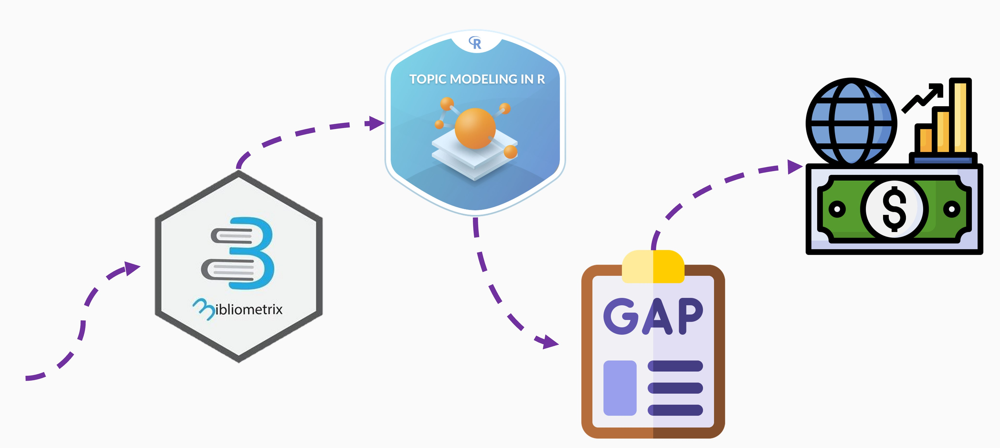

```{r setup, include=FALSE}
library(knitr)                              # paquete que trae funciones utiles para R Markdown
library(tidyverse)                          # paquete que trae varios paquetes comunes en el tidyverse
library(datos)                              # paquete que viene con datos populares traducidos al español :)
library(shiny)
library(fontawesome)
# opciones predeterminadas
knitr::opts_chunk$set(echo = FALSE,         # FALSE: los bloques de código NO se muestran
                      dpi = 300,            # asegura gráficos de alta resolución
                      warning = FALSE,      # los mensajes de advertencia NO se muestran
                      error = FALSE)        # los mensajes de error NO se muestran


options(htmltools.dir.version = FALSE)

```

```{r xaringan-panelset, echo=FALSE}
xaringanExtra::use_panelset()
xaringanExtra::use_share_again()
```


class: clear


.pull-left[

.center[

<br><br>

```{r echo=FALSE, out.width = "75%" }

```

]
]


.pull-right[


.center[


[Orlando Joaqui-Barandica, M.Sc.](https://www.joaquibarandica.com) <br/>
Universidad del Valle
]


.center[


[Diego F. Manotas-Duque, Ph.D.](http://industrial.univalle.edu.co/profesores/diego-fernando-manotas-duque) <br>
Universidad del Valle
]

.center[


[Jorge M. Uribe, Ph.D.](https://jorgemuribe.com/) <br>
Universitat Oberta de Catalunya
]

]


???

Buenas tardes, el día de hoy socializaré mi propuesta de investigación doctoral en tópicos de activos y pasivos: una visión comparativa entre economías emergentes y desarrolladas.

Esta tesis doctoral está bajo la dirección del profesor Diego Manotas de la Escuela de Ing. Industrial de la Universidad del Valle. Y el profesor Jorge M. Uribe de la Universitat Oberta de Catalunya..

Este trabajo de investigación está integrado al grupo de investigación GIFINC de la Esc. de Ing. Ind.

---


class: contenido


# Contenido


.pull-left[
</br>
###  `r icon::fa("angle-double-right",  animate = "passing")` <font color="#0A2A1A" size=6> Motivación </font>
###  `r icon::fa("angle-double-right", animate = "float")` <font color="#0A2A1A" size=6> Revisión de Literatura </font>
###  `r icon::fa("angle-double-right", animate = "float")` <font color="#0A2A1A" size=6> Objetivos </font>
###  `r icon::fa("angle-double-right", animate = "float")` <font color="#0A2A1A" size=6> Metodología </font>
###  `r icon::fa("angle-double-right", animate = "float")` <font color="#0A2A1A" size=6> Productos </font>
]
.pull.right[

]


???

El día de hoy.. iniciaré presentado la motivación de esta investigación,,

Seguido de la revisión de literatura y antecedentes en el marco de este tema de gestión de activos y pasivos.

Enunciaré los objetivos establecidos en mi propuesta doctoral.

Paso seguido mostraré las fases metodológicas propuestas para lograr los objetivos planteados,

y... por último comentaré... algunos productos obtenidos a la fecha.


---


name: Motivation
class: inverse, mline, center, middle


# Motivación

???


---


# Motivación


## La gestión de activos y pasivos... 

<br>

.center[ 
.font170[*Asset Liability Management "ALM"...*]
]

<br>

.right[
.font170[*"El proceso continuo de formular, poner en práctica, supervisar y revisar las estrategias relacionadas con los activos y pasivos, con el fin de alcanzar los objetivos financieros fijados para un conjunto dado de tolerancias y restricciones de riesgo."*
]

SOA (1998)

]

???

Primero, es importante definir el concepto de "Gestión de activos y pasivos" conocido en inglés como "Asset liability management" el cual se aplica sobre las empresas y se  define como: ...

Nótese que el concepto en si mismo.. presenta interacción entre TRES GRANDES ASPECTOS:
un **conjunto de estrategias** que permiten **logros financieros** contemplando ciertos **riesgos..**


Una característica común de estos problemas es que existen dos grandes fuentes de **incertidumbre**, por un lado, la incertidumbre resultante del lado de los pasivos en la ecuación, por ejemplo, derivada de una financiación insuficiente. 

Y por otro, la incertidumbre de la rentabilidad de los activos. En conjunto, constituyen una dificultad no trivial sobre cómo gestionar el riesgo en el modelo aplicado por la institución financiera. 


---


# Motivación


```{r}

```

???

Entonces... bajo la dinámica de estos tres aspectos.. las empresas deben de encaminarse a realizar un análisis más próximo del entorno en el que se ubican para evitar efectos negativos a la estructura financiera del balance.

Los administradores o gerentes se enfrentan entonces al gran reto de aprovechar las oportunidades del mercado, manteniendo muy cuidadosamente la exposición a los riesgos dentro de la tolerancia que admita la entidad.

Aquí el administrador de activos y pasivos, como lo planteo es el director de la orquesta!! Tiene la gran responsabilidad de maximizar el rendimiento, gestionando correctamente los distintos tipos de riesgo que se puedan presentar.


---


# Motivación

.left-column[

.left[

## Rentabilidad... 

... se define como la capacidad de aprovechar los recursos para generar utilidades, por tanto, es relevante como indicador de una gestión eficaz.

]

]


.right-column[

## Características idiosincráticas vs. Fuerzas comunes

.font120[
Identificar los determinantes de la rentabilidad y anticiparse a sus fluctuaciones garantiza la toma de decisiones oportunas e informadas que maximizan el valor para los grupos de interés de la empresa.


.pull-left[
**Determinantes internos**
* `Edad`
* `Tamaño`
* `Apalancamiento financiero`
* etc.
]


.pull-right[
**Determinantes externos**
* `Precios de combustible`
* `Tasas de interés`
* `Tasas de cambio`
* `Actividad económica`
* etc.

]

]

]

???

Bueno, enfocandonos en los conceptos de eficiencia financiera, podemos tener en cuenta la rentabilidad que se define como....

Si bien una entidad o gerente debe enfocarse en tener presente la estructura del balance... es importante preguntarse que puede determinar cambios en dicha estructura que amerite cambios en las estrategias de gestión...

Ahora, imaginate a un gerente que pueda tener conocimiento de qué hacer ante un choque inesperado,, es decir, que pueda anticiparse por ejemplo ante la subida de las tasas de interés, y sepa como responder o que estrategias enmarcar para la empresa.

Se hace entonces necesario identificar qué aspectos se relacionan con dicha estructura financera en el balance. Aquí es dónde aparecen los determinantes de tipo interno y externo..

Siendo determinantes de tipo interno.. el tamaño de la empresa medido desde su capitalización de mercado, el tiempo de la empresa, el apalancamiento, en fin, característica netamente idiosicráticas que de una u otra manera están como información primaria para el geerente, es decir bajo conocimiento constante de gerencia. 

Ahora bien, no solo condiciones internas afectan a una empresa. Los determinantes externo también subyacen como fuerzas comunes a empresas de un sector específico, o de un país específico, etc.. por eso tenemos aspectos como los precios de los combustibles, la inflación, la tasa de interés, tasa de cambio, etc..


Se hace necesario entonces... estudiar en qué grado estos aspectos impactan la eficiencia financiera de una empresa. Más aun comprender de una mejor manera los determinantes externos, puesto que estos presentan mayor incertidumbre para la gerencia, si los comparamos con los determinantes internos que continuamente se encuentran bajo supervisión de la entidad.


---


# Motivación

<div class="rotate"></div>


<br>


.pull-left[

### `r anicon::faa("angle-double-right", animate = "passing")` Globalización de mercados


### `r anicon::faa("angle-double-right", animate = "passing")` Competencia entre empresas


### `r anicon::faa("angle-double-right", animate = "passing")` Análisis del entorno


### `r anicon::faa("angle-double-right", animate = "passing")` Estrategias de gestión ante la incertidumbre


### `r anicon::faa("angle-double-right", animate = "passing")` Entorno macrofinanciero, climático, etc.

]


???


Durante las últimas décadas, es importante señalar que se ha incrementado la globalización de los mercados financieros, la intensificación de la competencia en los mercados bancarios nacionales e internacionales y la introducción de productos  complejos con alta volatilidad y riesgo. 

Es por este nuevo entorno económico que las  instituciones a nivel mundial enfrentan nuevos desafíos para revisar sus estrategias, para proceder tanto a las innovaciones tecnológicas como a las fusiones y adquisiciones, así como para hacer frente a choques macroeconómicos; los cuales pueden afectar las decisiones en la estructura de capital. 


En esta interconexion de mercados, empresas, gerencia y stakeholders, es vital estudiar las sensibilidades del desempeño financiero ante cambios en el entorno, principalmente escenarios que subyacen a la rentabilidad empresarial y que es común a las todas las instituciones. Buscamos primeramente identificar la existencia de factores macroeconómicos que determinen patrones generales en los indicadores financieros, para que la gestión del balance financiero sea equilibrada.


---


name: Literatura
class: inverse, mline, center, middle


# Revisión de literatura

???


---


# Revisión de literatura

```{r literatura, fig.align="center", out.width="80%"}
knitr::include_graphics("img/literatura.jpg")
```


> `r anicon::faa("angle-double-right", animate = "passing")`  (Joaqui-Barandica & Manotas-Duque, 2022)

---


# Revisión de literatura

<br>


### ALM se centra...

<br>

.pull-left[

.font120[
* ... en el lado de los `activos`, en los riesgos de mercado, crédito y liquidez.

* ... en el lado de los `pasivos`, en las volatilidades de los márgenes y los costos. 
]

]

.pull-right[

.center[

.font140[**A partir de aquí, el problema de modelación de ALM en la literatura se ha clasificado en `modelos determinísticos` o `modelos estocásticos`**]

]

]

<br>
<br>
<br>

> `r anicon::faa("angle-double-right", animate = "passing")`  (Florez, 2005; Zopounidis et al., 2010)

???


---


# Revisión de literatura

<br>
<br>

.pull-left-narrow[.center[`r fontawesome::fa("buffer", height = "5em")`]]

.pull-right-wide[

.font120[
> La modelación estocástica proporciona un marco de modelado de propósito general, que captura las características del mundo real, tales como restricciones de rotación, costos de transacción, aversión al riesgo, límites en grupos de activos y otras consideraciones.

]

]


<hr>
<br>


--

<br>


.pull-left-narrow[.center[`r fontawesome::fa("brain", height = "5em")`]]

.pull-right-wide[

.font120[
> El modelo de optimización puede resultar a veces intratable para la enorme cantidad de variables de decisión que se involucran.

]

]

---


# Revisión de literatura


.pull-left[

### Determinantes internos `r anicon::faa("arrow-alt-circle-down", animate = "falling")`


.font120[

> * Le & Ngo (2020)
> * Kumar et al., (2021)
> * Duan & Niu (2020)
> * Fernandes et al., (2021)
> * Davydov et al., (2021)
> * Evans & Haq (2021)
> * ...

]

Encontramos determinantes internos, como la estructura y tamaño de los activos y la estructura financiera y de capital de las instituciones financieras. En este mismo grupo se analizan determinantes internos de carácter operativo.


]

.pull-right[

### Determinantes externos `r anicon::faa("arrow-alt-circle-down", animate = "falling")`


.font120[

> * Kanas et al., (2012)
> * Martins et al., (2019)
> * Alessandri & Nelson (2015)
> * Molyneux et al., (2019)
> * Borio et al., 2017
> * Detragiache et al., 2018
> * ...

]

Este grupo de factores incluye determinantes macroeconómicos fundamentales y factores de mercado, como la competencia y la cuota de mercado.


]


---


# Revisión de literatura


.font180[**En general...**]


.font120[

- **Tema 1:** Financiero y económico: Gestión bancaria, sustentabilidad, préstamos y fondos


- **Tema 2:** Modelación estocástica


- **Tema 3:** Optimización


]

--

.right[

.font180[**GAPS...**]


.font120[

`Enfoques macroeconómicos`

`Enfoques climáticos`

`Comparativas entre economías emergentes y desarrolladas`

]
]


???


---


name: Objetivos
class: inverse, mline, center, middle


# Objetivos

???


---


class: inverse, mline, center, middle

# Objetivo General

<br>
<br>

.center[
.font170[Evaluar las estrategias ALM bajo diferentes estados macroeconómicos, de empresas pertenecientes a distintos sectores económicos, y localizadas en países con distintos grados de desarrollo.
]
]


---


class: inverse


.pull-left-narrow[

<br>
<br>
<br>
<br>
<br>
<br>

# Objetivos Específicos


]

.pull-right-wide[


.font110[.left[ 

> - Identificar factores macroeconómicos que determinen indicadores financieros para las empresas o instituciones del sector financiero.


]
]
]


---


class: inverse


.pull-left-narrow[

<br>
<br>
<br>
<br>
<br>
<br>

# Objetivos Específicos


]

.pull-right-wide[
.font110[.left[ 

> - Identificar factores macroeconómicos que determinen indicadores financieros para las empresas o instituciones del sector financiero.


<hr>


> - Evaluar el efecto de diferentes escenarios de factores macroeconómicos sobre las decisiones de gestión de activos y pasivos (ALM) de las empresas o instituciones del sector financiero.


]
]
]


---


class: inverse


.pull-left-narrow[

<br>
<br>
<br>
<br>
<br>
<br>

# Objetivos Específicos


]

.pull-right-wide[
.font110[.left[ 

> - Identificar factores macroeconómicos que determinen indicadores financieros para las empresas o instituciones del sector financiero.


<hr>


> - Evaluar el efecto de diferentes escenarios de factores macroeconómicos sobre las decisiones de gestión de activos y pasivos (ALM) de las empresas o instituciones del sector financiero.

<hr>

> - Determinar la composición óptima de portafolios de inversión de diferentes sectores frente a componentes sistemáticos macroeconómicos. 

]
]
]


---

class: inverse


.pull-left-narrow[

<br>
<br>
<br>
<br>
<br>
<br>

# Objetivos Específicos


]

.pull-right-wide[
.font110[.left[ 

> - Identificar factores macroeconómicos que determinen indicadores financieros para las empresas o instituciones del sector financiero.

<hr>

> - Evaluar el efecto de diferentes escenarios de factores macroeconómicos sobre las decisiones de gestión de activos y pasivos (ALM) de las empresas o instituciones del sector financiero.

<hr>

> - Determinar la composición óptima de portafolios de inversión de diferentes sectores frente a componentes sistemáticos macroeconómicos. 

<hr>

> - Identificar la relación existente entre las estrategias de ALM de las empresas o instituciones financieras en países emergentes vs. empresas de países con un mayor desarrollo económico.


]
]
]


---


name: Methodology

class: inverse, mline, center, middle


# Metodología

???


---


# Metodología


.panelset[
.panel[.panel-name[Fase Inicial]


> `r anicon::faa("angle-double-right", animate = "passing")`  Análisis bibliométrico de las temáticas de ALM.

> `r anicon::faa("angle-double-right", animate = "passing")`  Identificación y proposición de variables y factores macroeconómicos para ser evaluados ante diferentes choques en el análisis estratégico de toma de decisiones en ALM.


```{r fase1, fig.align="center", out.width="60%"}

```


]


.panel[.panel-name[Objetivo 1]


```{r obj1, echo=FALSE, fig.align="center", out.width="80%"}

```


> `r anicon::faa("angle-double-right", animate = "passing")`  (Bai & Ng, 2008; Josse & Husson, 2012; McCracken & Ng, 2021; Stock & Watson, 2012; Yao et al., 2005).


]


.panel[.panel-name[Objetivo 2]


```{r obj2, echo=FALSE, fig.align="center", out.width="80%"}

```


> `r anicon::faa("angle-double-right", animate = "passing")`  (Bai & Ng, 2008; Gasparrini, 2011).


]


.panel[.panel-name[Objetivo 3]


```{r obj3, echo=FALSE, fig.align="center", out.width="80%"}

```


> `r anicon::faa("angle-double-right", animate = "passing")`  (Cornuejols & Tütüncü, 2006; Morgan, 1996; Strub & Baumann, 2018).


]


.panel[.panel-name[Objetivo 4]


```{r obj4, echo=FALSE, fig.align="center", out.width="80%"}

```


> `r anicon::faa("angle-double-right", animate = "passing")`  (Escofier & Pagés, 1998; Pagés, 2002).


]


]


???


---


name: Results

class: inverse, mline, center, middle


# Resultados a la fecha

???


---


# Productos

### Publicados

.pull-left-narrow[

```{r Entramado, echo=FALSE, fig.align="center", out.width="23%"}
knitr::include_graphics("img/entramado.png")
```

]

.pull-right-wide[
[Assets Liability Management: A bibliometric analysis and topic modeling](https://www.joaquibarandica.com/publication/bibliometric/), 2022 - (with Manotas-Duque, D. F.). ‘ENTRAMADO’
]


.pull-left-narrow[
```{r NAJEF, echo=FALSE, fig.align="center", out.width="23%"}
knitr::include_graphics("img/NAJEF.jpg")
```
]

.pull-right-wide[
[Commonality, macroeconomic factors and banking profitability](https://www.joaquibarandica.com/publication/commonality/), 2022 - (with Manotas-Duque, D. F., Uribe, J.M.). ‘THE NORTH AMERICAN JOURNAL OF ECONOMICS AND FINANCE’
]

--

### En revisión


.pull-left-narrow[
```{r PNG, echo=FALSE, fig.align="center", out.width="23%"}
knitr::include_graphics("img/ej.png")
```
]


.pull-right-wide[
[Common factors in the profitability of energy firms](https://www.joaquibarandica.com) - (with Manotas-Duque, D. F., Uribe, J.M.). ‘THE ENERGY JOURNAL’
]


.pull-left-narrow[
```{r reports, echo=FALSE, fig.align="center", out.width="23%"}

```
]


.pull-right-wide[
[Decision tools from index fund finance to explore the path towards a scenario of renewable energy generation with globalization and high specialization of regional electricity markets](https://www.joaquibarandica.com) - (with Manotas-Duque, D. F., Uribe, J.M.). ‘ENERGY REPORTS’
]


---


# Productos


<br>
<br>


### En desarrollo


.pull-left-narrow[
```{r rueda, echo=FALSE, fig.align="center", out.width="50%"}
knitr::include_graphics("img/rueda.png")
```
]


.pull-right-wide[
[Global liquidity and the profitability of energy firms](https://www.joaquibarandica.com/) 
- (with Manotas-Duque, D. F., Uribe, J.M.).
]


.pull-left-narrow[
```{r rueda2, echo=FALSE, fig.align="center", out.width="50%"}
knitr::include_graphics("img/rueda.png")
```
]


.pull-right-wide[
[Financial performance of companies in the electricity sector in emerging and developed economies: A pre-pandemic and post-pandemic view](https://www.joaquibarandica.com/) 
- (with Manotas-Duque, D. F., Uribe, J.M.).
]


---


# Productos

### Conferencias internacionales


.pull-left-narrow[
```{r ifabs, echo=FALSE, fig.align="center", out.width="70%"}
knitr::include_graphics("img/conf_ifabs.jpg")
```
]


.pull-right-wide[
[Commonality, macroeconomic factors and banking profitability](https://www.joaquibarandica.com/publication/commonality/), 2021 
- **IFABS 2021 - OXFORD (Virtual)** *(with Manotas-Duque, D. F., Uribe, J.M.).*
]


.pull-left-narrow[
```{r icee, echo=FALSE, fig.align="center", out.width="70%"}

```
]


.pull-right-wide[
[Global liquidity and the profitability of energy firms](https://www.joaquibarandica.com/) 
- **ICEE 2022 - PORTO, PORTUGAL*** *(with Manotas-Duque, D. F., Uribe, J.M.).*
]

--

#### Por venir


.pull-left-narrow[
```{r claio, echo=FALSE, fig.align="center", out.width="70%"}
knitr::include_graphics("img/conf_claio.jpg")
```
]


.pull-right-wide[
[Decision tools from index fund finance to explore the path towards a scenario of renewable energy generation with globalization and high specialization of regional electricity markets](https://www.joaquibarandica.com) 
- **CLAIO 2022 - BUENOS AIRES - ARGENTINA** *(with Manotas-Duque, D. F., Uribe, J.M.).*
]


---


# Productos


### Tesis (En desarrollo)


.pull-left-narrow[
```{r rueda3, echo=FALSE, fig.align="center", out.width="50%"}
knitr::include_graphics("img/rueda.png")
```
]


.pull-right-wide[
Análisis del desempeño financiero en empresas del sector de la electricidad en Latinoamérica: una comparativa a nivel de mercados emergentes y desarrollados en Colombia
- Trabajo de grado. Maestría en Ingeniería Industrial - *Universidad del Valle*.
]


.pull-left-narrow[
```{r rueda4, echo=FALSE, fig.align="center", out.width="50%"}
knitr::include_graphics("img/rueda.png")
```
]


.pull-right-wide[
Modelación no lineal (DLNM) del efecto de factores macroeconómicos sobre el índice MSCI Colombia de capitalización bursátil en el mercado de valores para el periodo 2001 a 2020
- Trabajo de grado. Pregrado en Estadística - *Universidad del Valle*
]


.pull-left-narrow[
```{r rueda5, echo=FALSE, fig.align="center", out.width="50%"}
knitr::include_graphics("img/rueda.png")
```
]


.pull-right-wide[
Modelación del efecto del precio de gas natural sobre el precio de la electricidad: Alemania en tiempo de crisis
- Trabajo de grado. Pregrado en Estadística - *Universidad del Valle*
]

---


class: inverse, mline, center, bottom


<br>


.pull-left[

```{r qr, echo=FALSE, fig.align="center", out.width="50%"}
knitr::include_graphics("img/qr-code.png")
```

<br>
<br>
<br>

.center[
www.joaquibarandica.com
]

]


.pull-right[

<br>
<br>
<br>


# Gracias !!!

<br>
<br>


.font140[**|**] `r anicon::faa("envelope", animate = "passing")` orlando.joaqui@correounivalle.edu.co

.font140[**|**] `r anicon::faa("envelope", animate = "passing")` diego.manotas@correounivalle.edu.co

.font140[**|**] `r anicon::faa("envelope", animate = "passing")` juribeg@uoc.edu

<br>
<br>
<br>
<br>

]

???


